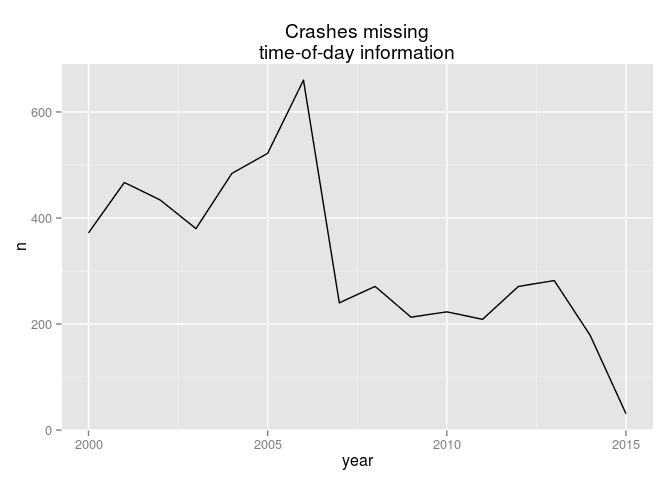
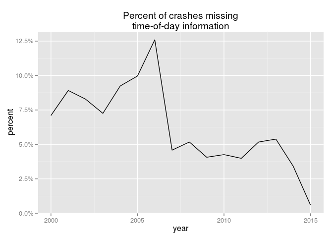
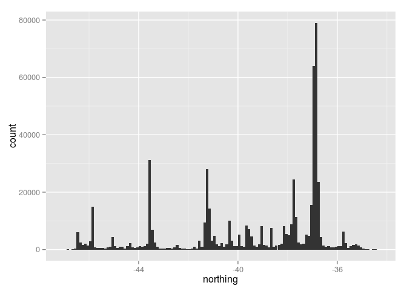
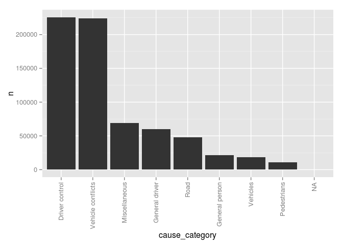
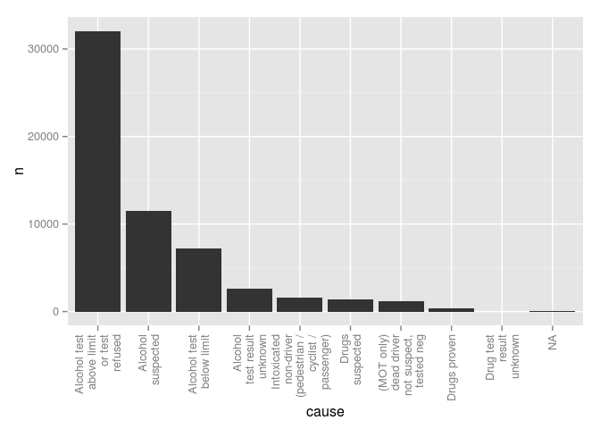

``` {.r}
library(nzcrash)
library(dplyr)
library(tidyr)
library(magrittr)
library(stringr)
library(ggplot2)
library(scales)
library(lubridate)
```

nzcrash
=======

This package redistributes crash statistics already available from the New Zealand Transport Agency, but in a more convenient form.

It's a large package (over 20 megabytes, compressed).

Datasets
--------

The `crashes` dataset describes most facts about a crash. The datasets `causes`, `vehicles`, and `objects_struck` describe facts that are in a many-to-one relationship with crashes. They can be joined to the `crashes` dataset by the common `id` column. The `causes` dataset can additionally be joined to the `vehicles` dataset by the combination of the `id` and `vehicle_id` columns. This is most useful when the resulting table is also joined to the `crashes` dataset.

Up-to-date-ness
---------------

The data was last scraped from the NZTA website on 2015-07-20. At that time, the NZTA had published data up to the 2015-03-10.

``` {.r}
dim(crashes)
```

    ## [1] 540888     32

``` {.r}
dim(causes)
```

    ## [1] 888072      7

``` {.r}
dim(vehicles)
```

    ## [1] 979930      3

``` {.r}
dim(objects_struck)
```

    ## [1] 261276      3

Accuracy
--------

The [NZTA](http://www.transport.govt.nz/research/roadtoll/#5), doesn't agree with [itself](http://www.transport.govt.nz/research/roadtoll/annualroadtollhistoricalinformation/) about recent annual road tolls, and this dataset gives a third opinion.

``` {.r}
crashes %>% 
  filter(severity == "fatal") %>%
  group_by(year = year(date)) %>%
  summarize(fatalities = sum(fatalities))
```

    ## Source: local data frame [16 x 2]
    ## 
    ##    year fatalities
    ## 1  2000        462
    ## 2  2001        455
    ## 3  2002        405
    ## 4  2003        461
    ## 5  2004        435
    ## 6  2005        405
    ## 7  2006        393
    ## 8  2007        421
    ## 9  2008        366
    ## 10 2009        384
    ## 11 2010        375
    ## 12 2011        284
    ## 13 2012        308
    ## 14 2013        256
    ## 15 2014        279
    ## 16 2015         34

Severity
--------

Crashes categorised as "fatal", "serious", "minor" or "non-injury", based on the casualties. If there are any fatalities, then the crash is a "fatal" crash, otherwise if there are any 'severe' injuries, the crash is a "serious" crash.

The definition of a 'severe' injury is not clear.

Minor and non-injury crashes are likely to be under-recorded since they often do not involve the police, who write most of the crash reports upon which these datasets are based.

A common mistake is to confuse the number of fatal crashes with the number of fatalities.

``` {.r}
crashes %>% filter(severity == "fatal") %>% nrow
```

    ## [1] 5042

``` {.r}
sum(crashes$fatalities)
```

    ## [1] 5723

Dates and times
---------------

Three columns of the `crashes` dataset describe the date and time of the crash in the NZST time zone (Pacific/Auckland).

-   `date` gives the date without the time
-   `time` gives the time where this is available, and NA otherwise. Times are stored as date-times on the first of January, 1970.
-   `datetime` gives the date and time in one value when both are available, and NA otherwise. `date` is always available, however `time` is not.

When aggregating by some function of the date, e.g. by year, then always start from the `date` column unless you also need the time. This ensures against accidentally discounting crashes where a time is not recorded.

``` {.r}
crashes %>%
  filter(is.na(time)) %>%
  count(year = year(date)) %>%
  ggplot(aes(year, n)) +
  geom_line() +
  ggtitle("Crashes missing\ntime-of-day information")

crashes %>%
  filter(is.na(time)) %>%
  count(year = year(date)) %>%
  mutate(percent = n/sum(n)) %>%
  ggplot(aes(year, percent)) +
  geom_line() +
  scale_y_continuous(labels = percent) +
  ggtitle("Percent of crashes missing\ntime-of-day information")
```

 

Location coordinates
--------------------

99.9% of crashes have coordinates. These have been converted from the NZTM projection to the WGS84 projection for convenience with packages like `ggmap`.

Because New Zealand is tall and skinny, you can easily spot the main population centres with a simple boxplot.

``` {.r}
crashes %>%
  ggplot(aes(northing)) +
  geom_histogram(binwidth = .1)
```



Vehicles
--------

There can be many vehicles in one crash, so vehicles are recorded in a separate `vehicles` dataset that can be joined to `crashes` by the common `id` column.

``` {.r}
crashes %>%
  inner_join(vehicles, by = "id") %>%
  count(vehicle) %>% 
  arrange(desc(n))
```

    ## Source: local data frame [12 x 2]
    ## 
    ##               vehicle      n
    ## 1                 Car 728119
    ## 2            Van, ute  87927
    ## 3  SUV or 4x4 vehicle  48269
    ## 4               Truck  44305
    ## 5          Motorcycle  17733
    ## 6                  NA  16996
    ## 7             Bicycle  15713
    ## 8                 Bus   8066
    ## 9    Taxi or taxi van   6792
    ## 10              Moped   3594
    ## 11   Other or unknown   2043
    ## 12         School bus    373

Objects struck
--------------

There can be many objects struck in one crash, so these are recorded in a separate `objects_struck` dataset that can be joined to `crashes` by the common `id` column.

Q: What are more fatal, trees or lamp posts?

``` {.r}
crashes %>%
  inner_join(objects_struck, by = "id") %>%
  filter(object %in% c("Trees, shrubbery of a substantial nature"
                               , "Utility pole, includes lighting columns")
  , severity != "non-injury") %>% # non-injury crashes are poorly recorded
  count(object, severity) %>% 
  group_by(object) %>%
  mutate(percent = n/sum(n)) %>%
  select(-n) %>%
  spread(severity, percent)
```

    ## Source: local data frame [2 x 4]
    ## 
    ##                                     object      fatal   serious     minor
    ## 1  Utility pole, includes lighting columns 0.04432701 0.2149482 0.7407248
    ## 2 Trees, shrubbery of a substantial nature 0.06742092 0.2459016 0.6866774

A: Trees (Don't worry, I know it's harder than that.)

Causes
------

Causes can be joined either to the `crashes` dataset (by the common `id` column), or to the `vehicles` dataset (by both of the commont `id` and `vehicle_id`) columns.

The main cause groups are given in the `causes_category` column.

``` {.r}
crashes %>%
  inner_join(causes, by = "id") %>%
  group_by(cause_category, id) %>%
  tally %>%
  group_by(cause_category) %>%
  summarize(n = n()) %>%
  arrange(desc(n)) %>%
  mutate(cause_category = factor(cause_category, levels = cause_category)) %>%
  ggplot(aes(cause_category, n)) + 
  geom_bar(stat = "identity") +
  theme(axis.text.x = element_text(angle = 90, hjust = 1, vjust = .5))
```



That's odd -- where are speed, alcohol, and restraints? They're given in `cause_subcategory`.

``` {.r}
causes %>% 
  filter(cause_subcategory == "Too fast for conditions") %>%
  count(cause) %>% 
  arrange(desc(n))
```

    ## Source: local data frame [8 x 2]
    ## 
    ##                                cause     n
    ## 1                          Cornering 37861
    ## 2                        On straight 10196
    ## 3                                 NA  7119
    ## 4        To give way at intersection  1658
    ## 5           At temporary speed limit  1010
    ## 6              At crash or emergency    55
    ## 7       Approaching railway crossing    44
    ## 8 When passing stationary school bus    37

There's nothing there about speed limit violations, because it's impossible to tell what speed a vehicle was going at when it crashed.

More worryingly, how is "Alcohol test below limit" a cause for a crash? Hopefully they filter those out when making policy decisions.

``` {.r}
levels(causes$cause) <-                # Wrap facet labels
  str_wrap(levels(causes$cause), 13)
crashes %>%
  inner_join(causes, by = "id") %>%
  filter(cause_subcategory %in% c("Alcohol or drugs")) %>%
  group_by(cause, id) %>%
  tally %>%
  group_by(cause) %>%
  summarize(n = n()) %>%               # This extra step deals with many causes per crash
  arrange(desc(n)) %>%
  mutate(cause= factor(cause, levels = cause)) %>%
  ggplot(aes(cause, n)) + 
  geom_bar(stat = "identity") +
  theme(axis.text.x = element_text(angle = 90, hjust = 1, vjust = .5))
```



``` {.r}
rm(causes)                             # Because we messed up the factor levels
```

This time, join `causes` to both `vehicles` and `crashes` to assess the drunken cyclist menace.

``` {.r}
crashes %>%
  filter(severity == "fatal") %>%
  select(id) %>%
  inner_join(vehicles, by = "id") %>% 
  filter(vehicle == "Bicycle") %>%
  inner_join(causes, by = c("id", "vehicle_id")) %>% 
  count(cause) %>%
  arrange(desc(n))
```

    ## Source: local data frame [55 x 2]
    ## 
    ##                                                                  cause  n
    ## 1  Behind when changing lanes position or direction (includes U-turns) 26
    ## 2                                                                   NA 20
    ## 3          When required to give way to traffic from another direction 10
    ## 4                                                Wandering or wobbling  8
    ## 5                                                     At Give Way sign  4
    ## 6                           Cyclist or M/cyclist wearing dark clothing  4
    ## 7                                        Driving or riding on footpath  4
    ## 8                                             On left without due care  4
    ## 9                              When pulling out or moving to the right  4
    ## 10                                                 At steady red light  3
    ## ..                                                                 ... ..

I think we all know what "Wandering or wobbling" means.
